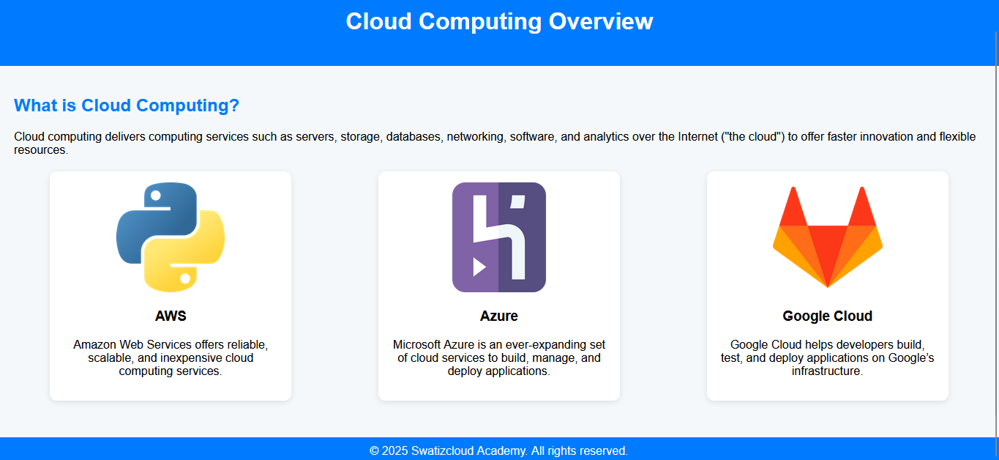

## 🚀 EC2 Provisioning and LEMP Stack Automation with Terraform + Ansible-

---

### 📌 **Project Goal:**

Provision an EC2 instance using **Terraform**, copy the private IP to an **Ansible inventory file**, and use **Ansible** to install the **LEMP stack (Linux, Nginx, MySQL, PHP)** and copy the **index.html** on it.

---

### 🔑 **Prerequisites**

Before running this project, make sure you have the following set up:

  ✅ AWS Account with IAM user and key pair created

  ✅ AWS CLI installed and configured (aws configure)

  ✅ Terraform installed (v1.0+ recommended)
      Install Terraform →

```bash
wget -O - https://apt.releases.hashicorp.com/gpg | sudo gpg --dearmor -o /usr/share/keyrings/hashicorp-archive-keyring.gpg
echo "deb [arch=$(dpkg --print-architecture) signed-by=/usr/share/keyrings/hashicorp-archive-keyring.gpg] https://apt.releases.hashicorp.com $(grep -oP '(?<=UBUNTU_CODENAME=).*' /etc/os-release || lsb_release -cs) main" | sudo tee /etc/apt/sources.list.d/hashicorp.list
sudo apt update && sudo apt install terraform
```

  ✅ Ansible installed

```bash
  sudo apt update
  sudo apt install software-properties-common
  sudo add-apt-repository --yes --update ppa:ansible/ansible
  sudo apt install ansible
```

  ✅ An SSH key pair (your-key.pem) added to AWS EC2 and available at ~/.ssh/your-key.pem

---

### 📁 **Project Structure:**

```
terraform-ansible-lemp/
├── terraform/
│   ├── main.tf
│   ├── variables.tf
├── ansible/
│   ├── hosts.ini
│   └── lemp.yml
├── index.html
├── run.sh
├── README.md
```

---

### ⚙️ **Technologies Used:**

* **Terraform** – Infrastructure as Code to provision EC2
* **Ansible** – Configuration management for LEMP installation
* **AWS EC2** – Cloud virtual server
* **Ubuntu 24.04** – EC2 OS
* **LEMP Stack** – Linux, Nginx, Mariadb-serverL, PHP

---

### 🔧 **Setup Instructions:**

#### 1. Clone the Repository:

```bash
git clone https://github.com/Swatiz-cloud/terraform-ansible-lemp.git
cd terraform-ansible-lemp
```

## 📄 Sample Terraform Template (terraform/main.tf)

```bash
terraform {
  required_version = "~> 1.1"
  required_providers {
    aws = {
      source  = "hashicorp/aws"
      version = "~> 5.0"
    }
  }
}
 
# Configure the AWS Provider
provider "aws" {
  region = var.region
}

resource "aws_instance" "web" {
  ami           = var.ami_id
  instance_type = var.instance_type
  key_name      = var.key_name
  vpc_security_group_ids = [aws_security_group.mysg.id]
  tags = {
    Name = "TerraformAnsibleLEMP"
  }
  provisioner "local-exec" {
    command = "echo [webserver] > ../ansible/hosts.ini && echo ${self.private_ip} ansible_user=ubuntu ansible_ssh_private_key_file=~/.ssh/mygitkey.pem >> ../ansible/hosts.ini"
  }
}

resource "aws_security_group" "mysg" {
egress {
    from_port        = 0
    to_port          = 0
    protocol         = "-1"
    cidr_blocks      = ["0.0.0.0/0"]
    ipv6_cidr_blocks = ["::/0"]
  }
  ingress {
    from_port        = 22
    to_port          = 22
    protocol         = "tcp"
    cidr_blocks      = ["0.0.0.0/0"]
  }
  ingress {
    from_port        = 80
    to_port          = 80
    protocol         = "tcp"
    cidr_blocks      = ["0.0.0.0/0"]
  }
}

output "public_ip" {
  value = aws_instance.web.public_ip
}
output "private_ip" {
  value = aws_instance.web.private_ip
}
```

## 📄 Sample variables.tf (terraform/variables.tf)

```bash
variable "region" {
  default = "ap-south-1"
}

variable "instance_type" {
  default = "t2.micro"
}

variable "key_name" {
  default = "mygitkey"
}

variable "ami_id" {
  default = "ami-0e35ddab05955cf57"
}
```
---
#### 2. Update Terraform Files:

In `terraform/variables.tf`, update:

* `region` (your applicable region)
* `ami_id` (based on region)
* `instance_type` (mention your required instance-type)
* `key_name` (your EC2 key pair name)
* Replace `your-key.pem` with the correct path to your private key

## 📄 Sample Ansible Playbookfile (ansible/lemp.yml)

```bash
- name: Install LEMP stack on Ubuntu server
  hosts: webserver
  become: yes
  tasks:
    - name: update apt
      shell: apt update
    - name: Install nginx
      apt: 
       name: nginx
       state: present
    - name: start nginx
      service:
       name: nginx
       state: started
    - name: Install mysql
      apt:
       name: mariadb-server
       state: present
    - name: start mysql
      service:
       name: mariadb
       state: started
    - name: install php
      apt:
       name: php
       state: present
    - name: install php-fpm
      apt: 
       name: php8.3-fpm
       state: present
    - name: start php-fpm
      service: 
       name: php8.3-fpm
       state: started
    - name: create index page
      copy:
       src: ../index.html
       dest: /var/www/html
    - name: restart nginx
      service: 
       name: nginx
       state: restarted
    - name: restart mariadb
      service:
       name: mariadb
       state: restarted
    - name: restart php-fpm
      service:
       name: php8.3-fpm
       state: restarted
```

## 📄 Sample Ansible Inventory (ansible/hosts.ini)

```bash
[webserver]
private_ip ansible_user=ubuntu ansible_ssh_private_key_file=~/.ssh/key_name.pem
```

## 📄 Sample Webpage (index.html) 
```bash
<!DOCTYPE html>
<html lang="en">
<head>
  <meta charset="UTF-8" />
  <meta name="viewport" content="width=device-width, initial-scale=1.0"/>
  <title>Cloud Computing Info</title>
  <style>
    body {
      font-family: Arial, sans-serif;
      background: #f4f8fb;
      margin: 0;
      padding: 0;
    }
    header {
      background: #007BFF;
      color: white;
      padding: 20px;
      text-align: center;
    }
    .container {
      padding: 20px;
    }
    h2 {
      color: #007BFF;
    }
    .cloud-section {
      display: flex;
      flex-wrap: wrap;
      gap: 20px;
      justify-content: space-around;
      margin-top: 20px;
    }
    .cloud-card {
      background: white;
      border-radius: 10px;
      box-shadow: 0 2px 8px rgba(0,0,0,0.1);
      width: 300px;
      padding: 15px;
      text-align: center;
    }
    .cloud-card img {
      max-width: 100%;
      height: 150px;
      object-fit: contain;
    }
    footer {
      background: #007BFF;
      color: white;
      text-align: center;
      padding: 10px;
      margin-top: 30px;
    }
  </style>
</head>
<body>

<header>
  <h1>Cloud Computing Overview</h1>
</header>

<div class="container">
  <h2>What is Cloud Computing?</h2>
  <p>
    Cloud computing delivers computing services such as servers, storage, databases, networking,
    software, and analytics over the Internet ("the cloud") to offer faster innovation and flexible resources.
  </p>

  <div class="cloud-section">
    <div class="cloud-card">
      
      <h3>AWS</h3>
      <p>Amazon Web Services offers reliable, scalable, and inexpensive cloud computing services.</p>
    </div>

    <div class="cloud-card">
      
      <h3>Azure</h3>
      <p>Microsoft Azure is an ever-expanding set of cloud services to build, manage, and deploy applications.</p>
    </div>

    <div class="cloud-card">
      
      <h3>Google Cloud</h3>
      <p>Google Cloud helps developers build, test, and deploy applications on Google’s infrastructure.</p>
    </div>
  </div>
</div>

<footer>
  &copy; 2025 Swatizcloud Academy. All rights reserved.
</footer>

</body>
</html>
```

## 📄 Sample Shellscript file (run.sh)

```bash
#!/bin/bash

cd terraform

echo "Applying Terraform..."
terraform init
terraform apply -auto-approve

echo "Waiting for instance to be ready..."
sleep 60

cd ../ansible

echo "Running Ansible playbook..."

ansible-playbook -i hosts.ini lemp.yml
```
#### 3. Make `run.sh` Executable:

```bash
chmod +x run.sh
```

#### 4. Run the Automation:

```bash
./run.sh
```

---

### 🌐 **Static Web Page Included**

A simple `index.html` file is included, containing cloud computing information styled with CSS and images.

To host this:

 **Ansible will place this index.html in `/var/www/html/` after LEMP setup**

* Visit the EC2 public IP to view the page.

---

### 📷 **Preview of the Web Page**


*A sample cloud info card in the index.html*

---

### ✅ **Validation Checklist:**

* [x] EC2 instance created
* [x] Public IP added to Ansible inventory
* [x] LEMP installed using Ansible
* [x] Web page accessible via EC2 IP

---

### 🧹 Cleanup

To avoid unnecessary AWS charges, destroy all provisioned resources:

```bash
cd terraform/
terraform destroy -auto-approve
```
Also, clean up temporary files:

```bash
rm -rf terraform/.terraform terraform/terraform.tfstate*
rm -f ansible/hosts.ini

---
